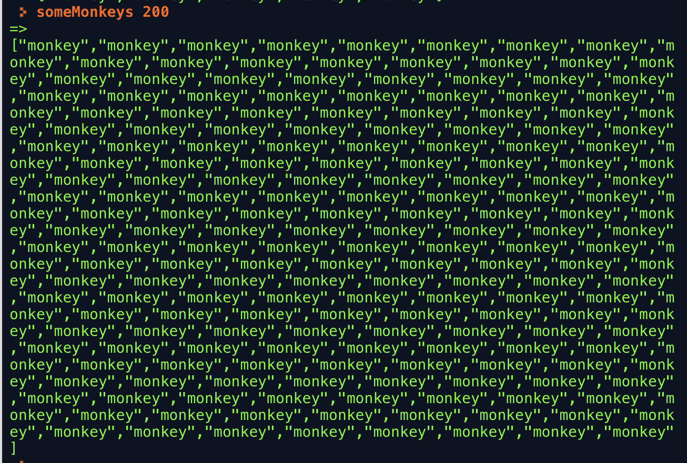
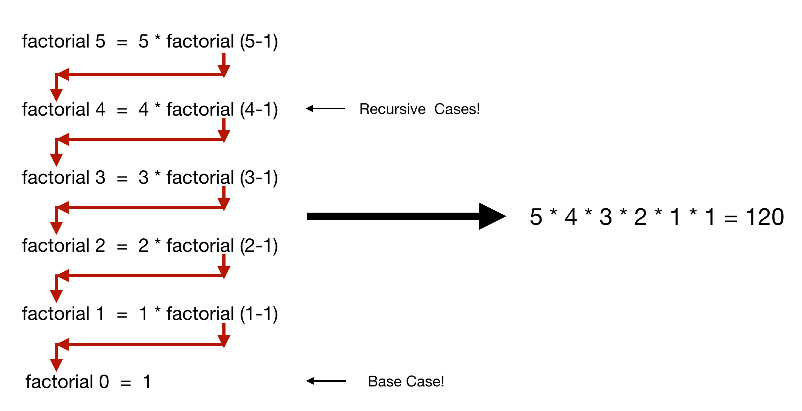

# Week 3 - Recursion

OK, team, we've gone easy on you so far, but this week we're going to challenge you.  Up until now, all the code you've written has been more or less a single expression.  Sometimes, as in the case of your nucleotide program if, that expression might have been complicated, but it was always just a simple evaluation.  This week, we're going to talk about how to do things multiple times. In most programming languages, you do this by _iteration_. In Haskell, and in most functional languages, you'll do this by _recursion_. You can fork your own copy of the repl here: https://repl.it/@peterb/Week-3-Recursion

Before we begin, THE THREE RULES:

1. There are no grades here. Try to think through the problems yourself, and ask for help on Google Classroom. You can look up answers to _all_ of these questions online, but the only person you're cheating by doing that is yourself.  However, **discussing the _concepts_, as opposed to the answers, with your classmates is _not cheating_, and I encourage you to do that as much as you want**.  Talking about the concepts is helpful to everyone!
2. Whenever I say "class program", I mean your copy of the Week 3 REPL, linked here.
3. I have provided type signatures for all of the functions in the class program. Changing the type signatures will almost certainly cause your program to break. If you want to experiment with changing them to try to figure out what they mean, go for it, but be warned that you might have to fork a new copy of the REPL if you can't fix it.  **If later in this document, say in the "Optional Topic" section, I tell you to change the type signature, it's probably because I'm a time-traveller from the future and am trying to trap you in a neverending dimension of transinfinite frustration!  Don't trust future me! RUN! SAVE YOURSELVES**!


## A Short History of Iteration

In the beginning, a computer was a person (most times, in the 20th century up until sometime after World War II, a woman) who did math for engineers, with pencil and paper.  When you wanted a computer to do some calculation a number of times, you'd tell her what you wanted in words - "Do step B 7 times, add up the results, and then go on to step C."

Human computers at NASA, 1955: 

### Go to this address in memory

Early electronic computers were often programmed in very low-level instructions called machine language, with "assembly language" being a slightly-more human readable version of ths.  Normally the computer would execute one instruction, then go to the memory location 1 position higher and execute the next instruction.  If you wanted to iterate some task, what you'd do is issue a conditional branch or jump instruction whose target was some other memory location.

Here's a very simple example with a made-up assembly language where each instruction takes up 4 bytes (don't type this into your REPL - it won't work!)

```
; Let's print the numbers from 0 through 9 
0000 MOVE 10 Y       ; Put 10 in the Y register
0000 MOVE 0 A        ; Put 0 in the A register
0004 CALL $FDDB      ; Print
0008 INC A           ; Increment (add 1 to) the value in A
0012 SUB Y A X       ; Subtract A from Y, put the result in X
0016 BRZ X 0024      ; If X is 0, jump to memory location 24
0020 JMP 0004        ; If not, jump back to memory location 4
0024 HALT
```

This type of iteration is very prone to mistakes and it's hard to read, as you can see.

### Iteration with statements - "Loops"

As higher-level and better languages were developed, and they usually included special syntax to make iteration easier. For example, here's the same program, written in C. (Again, don't try this in your REPL.)

```
void count_up_to_ten()

for (int x = 0; x < 10; x++) {
    printf("%d", x);
}
```

Or in Python:

```
def count_up_to_ten():
  for x in range(0,10):
    print(x)
```

### But loops have baggage

There's a joke among programmers that goes like this:

_The **two** hardest problems in Computer Science are:_

1. _Cache invalidation_
2. _Naming things_
3. _Off-by-one errors._

And in fact, when I wrote those programs up above, my original plan was to count from 1 to 10!  But I had an off-by-one error, and so I changed the rules of the game to count from 0 to 9, instead. So we have a live example of how iteration "by hand", even with a statement to help us, is hard to do.

Another error that often happens when iterating is if we _change the thing we're iterating on_.  Think about this (admittedly silly) Python example:

```
x = 1000
myList = [1, 2, 3, 4, 5]
for item in myList:
  print(item)
  x = x + 1
  myList.append(x)

```

If you run that code in a Python REPL, what you'll see is that it will run forever because every time it loops, you make the list it has to iterate through even longer.  In this case, we did that on purpose, but it's very easy to make a mistake inside a loop that causes it to run forever.

We call what we did inside that loop, where we added new values to `myList` while we were iterating on it `mutation`.  "Mutate" in computer science just means "change". When you can mutate things in a program, we call it _mutability_. Mutability isn't necessarily bad - usually it's very useful! - but it can be a source of errors. 

Here's something about Haskell that's interesting: Within the space of a given function, _you can never mutate a variable_.  If in a certain part of a Haskell program, I say `x = 123`, then I cannot later say `x = x + 1`.  `x`, in that part of the program, will _always_  be 123.  (There are ways to reuse the same name in different contexts, which we will see today, but this idea of _immutability_ is one that will take some getting used to.)  This fact that variables in Haskell don't vary, is why I prefer to call them "names" or "bindings".

### Recursion

So ideally we would find some way to run "the same" code over and over again, as in our loops, but ideally in a way that is not subject to off-by-one errors, and which doesn't require us to mutate any variables.  The most common way of doing this in functional languages like Haskell is called _recursion_.

Recursion is the process of a function calling itself to solve a similar version of the problem.

I want to start by doing recursion the _wrong_ way.  Just like in the loop case, you _can_ write a function that calls itself in a way that won't help you.  In your class program on repl.it, you should see this function:

```
infiniteMonkeys = ["monkeys"] ++  infiniteMonkeys
```

This function puts the word "monkeys" in a list, and then adds it to whatever the function `infiniteMonkeys` does. Which is the same thing.

One of the coolest things about Haskell is that it actually allows us to deal with infinite data in a very clever way: if we say "Just give me the first 10 items", it will only calculate the first 10 items on the infinite list.   Therefore, in the REPL we can type:

```
  take 10 infiniteMonkeys
=> ["monkeys","monkeys","monkeys","monkeys","monkeys","monkeys","monkeys","monkeys","monkeys","monkeys"]
```

and it works just fine.  However, if we just type `infiniteMonkeys` in the REPL...well, go ahead and try it.  You'll probably have to reload the page to get it unlocked though, since the program will be overloaded with infinite "monkeys".

What we see here is that `infiniteMonkeys` is recursive (because it calls itself), it's not really _usefully_ recursive (because it might never stop running.  Useful recursive functions do their work and eventually finish that work.

Let's write a function that will terminate. I'm going to use a conditional to do this to make clear what's happening, but after that we will use pattern matching for almost all of our recursive functions.

```
someMonkeys :: Int -> [String]

someMonkeys amount = if amount == 0 
                     then [] 
                     else "monkey" : someMonkeys (amount - 1)
```

So, if "amount" is 0, then we just return the empty list - we do NOT keep recursing.  This is called the "base case", and all well-written recursive code has a base case.  Because comparing things to 0 is so easy to remember, it's a very common pattern for recursive code to count _down_ from the number the user gave, rather than up to the number the user gave.

If "amount" is NOT 0, we will add "monkey" to a list, and call someMonkeys again - this time with "amount" being one less than it was. Eventually, after we have recursed through the function some number of times, "amount" will be equal to zero and the function will go to the base case.

Let's rewrite `someMonkeys` in pattern-matching form.

```
someMonkeysPM :: Int -> [String]

someMonkeysPM 0      = []
someMonkeysPM amount = "monkey" : someMonkeys (amount - 1)
```

(See how much easier that is to read?)

Now we can have as many monkeys as we want.  That's a lot of monkeys.  


#### Worked Example: Factorial

Let's take a look at an example of recursion in Haskell.  We're going to use a really simple example: the factorial operation.

A factorial is a mathematical operation like addition or subtraction, usually using the operator `!`.  In math, `4!` means that we calculate the value `4 * 3 * 2 * 1`.  They're used a lot in probability and statistics.  For example, the formula (52! / 5! * 47!) tells us the number of possible 5-card poker hands in a 52-card deck. (The answer is over 2 and a half million!, and that's WITH the division, which demonstrates that factorials get really large really fast.

`4!` is pretty easy to calculate even in your head - 4 times 3 is 12, 12 times 2 is 24, and 24 times 1 is 24 - so `4! == 24`.  There's also a special case I should mention: `0! == 1`, which is useful for base cases.

More formally, a reasonable mathematical definition of factorial is as follows:  _For any number n > 0, n! is equal to `n * (n - 1)!`. For n = 0, n! is equal to 1._  Another way to phrase it would be:  _For any positive number, n! is equal to `1 * 2 * 3 ... * (n - 1) * n`_.  Factorial is undefined for negative numbers, so we don't have to worry about them.  (You could argue that `0!` shouldn't even be a thing, but it makes some types of math easier if we define it.)

In your repl, you should see the placeholder function we're going to use:

```
factorial :: Int -> Int

factorial = 0
```

Let's replace that wrong answer, 0, with an actual definition.

Since we've been told we have to write a recursive definition, we **know** we are going to need a base case, and a recursive case.  Something I like to do when I am able is write out all the cases at once, even before I've written any code.

So using 0 as a base case is usually a good idea, so let's start there.

```
factorial 0 = _something
factorial n = _something_that_calls_factorial
```

If you click "Run" now, you'll get a bunch of scary looking errors but all they're telling us is that we left holes in the program named `_something` and `_something_that_calls_factorial`, and that Haskell wants them both to be Ints because of our type signature (which you do not want to change).

We know that the factorial of 0 is always 1, so let's replace that first `_something` with that.

```
factorial 0 = 1
factorial n = _something_that_calls_factorial
```

What if we have a positive number? Let's think about the case where we want `1!`

`1!` is the same as `1 * 0!` which is the same as `1 * 1`.  So the trick we're going to use here is to subtract 1 from n each time through the factorial function, just like in the math definition:

```
factorial 0 = 1
factorial n = n * factorial (n - 1)
```

And that's it -- we're done!  Try it out for yourself.

```
   factorial 5
=> 120
   factorial 10
=> 3628800
   factorial 20
=> 2432902008176640000
```

This might seem like incomprehensible magic to you, so let's look closer into how this function works. If I call `factorial 5`, the function is going to head to its recursive case. We have set n equal to 5, so the function will take 5 and multiply it by the same function where n is equal to 5 - 1, or 4. A diagram might look something like this:



On the left side, you see the recursion process that `factorial 5` would go through. On the right side, you see what it will end up being mathematically equivalent to, or what it would 'simplify' to.

##### Optional Topic: Int vs Integer

This is an advanced topic that you probably will never need to know in your lifetime about how numbers work inside the computer. You can skip this section if you're not interested; you don't need it for the homeworks.  

You may remember way back in the first week I mentioned that there was an `Int` type and also an `Integer` type, and that the differences didn't matter to us.  Usually they don't.  But `factorial` offers a chance to see how they're different.

If you type `factorial 49`, you'll get a large number.  If you type `factorial 50`, you'll get...a really large _negative_ number.  What the heck happened?

The answer is that for efficiency, `Int` is a 64 bit signed number, stored in what's called "2's complement" form.  That means that the number takes up 64 bits of space inside the computer, with the first bit being used to indicate whether it's positive or negative.  This means the largest number an `Int` can represent is 2 to the 63rd power, or, if I'm counting correctly, roughly 9.2 quintillion.  In practice, this is usually more than enough numbers for anything we want to do.

However, if we want bigger numbers, we have them: `Integer` is a data type (I haven't explained what that is yet, but roll with it) that has an arbitrary size. In fact, if you **ignore what I told you** at the start of this lesson and change both instances of `Int` to `Integer` in the type signature of `factorial`, you can now get correct answers for `factorial 50` and larger numbers.  If you pick a number that's too large, your REPL will hang.  Congratulations! Breaking things is a big part of learning. If this happened to you, hit reload to get it back.

Why don't we just use `Integer` all the time instead of `Int`? Because (1) we hardly ever need numbers that big and (2) we pay a cost for it, because computing with `Integer` is much slower than computing with `Int`.

#### Homework 1: The Fibonacci Sequence

The Fibonacci sequence, which appears in weird places in real life, such as the shells of snails, is defined as follows:

The first fibonacci number is 0.
The second fibonacci number is 1.
The third and subsequent fibonacci numbers are the sum of the previous two fibonacci numbers.

**Your assignment is:  Complete the function 'fibonacci' that, given a number n, tells you the nth fibonacci number.**

Working through the first few answers by hand (but not in code)

`fibonacci 1` is 0, by definition.

`fibonacci 2` is 0, by definition.

`fibonacci 3` is 1, because `0 + 1 = 1`.

`fibonacci 4` is 2, because `1 + 1 = 2`.

`fibonacci 5` is 3, because `1 + 2 = 3`.

`fibonacci 6` is 5, because `2 + 3 = 5`.

`fibonacci 7` is 8, because `3 + 5 = 8`.

`fibonacci 8` is 13, because `8 + 5 = 13`.

Like factorials, fibonacci numbers get bigger surprisingly fast.  For your testing convenience, the first 29 fibonacci numbers are `0, 1, 1, 2, 3, 5, 8, 13, 21, 34, 55, 89, 144, 233, 377, 610, 987, 1597, 2584, 4181, 6765, 10946, 17711, 28657, 46368, 75025, 121393, 196418, 317811`.

### Recursion and Lists

From last week, remember the definition of a list:

**A list of type t is either an empty list `[]`, or an item of type t followed by a list of type t.**

The interesting thing about this is that lists are _defined recursively_.  It's not a coincidence that recursion is a great way to work with lists.

#### Worked Example: Length of a List

Let's write a function that, given a list, tells you how long it is.  (Haskell ships with this function built in, but it's still useful for us to build it ourselves.)

```
listLength :: [a] -> Int

listLength myList = 0
```

The type annotation [a] means "listLen takes as input a list of anything, and returns an integer".  Since we're not doing anything with elements of the list except counting them, we don't care what the list contains.

So let's repeat the _most important thing about recursion_: A recursive definition has a **base case** and a **recursive case**, right?  What's the base case for a list?  We can't use `0`, since a list isn't a number.  So what is it?

The base case for recursion involving lists is almost always a list with nothing in it, called "the empty list" or sometimes "nil" or "`[]`".  So let's replace that first definition with:

```
listLength [] = _something
```

How long is a list with nothing in it?  Clearly, it's 0.

```
listLength [] = 0
```

Next, we have to define our recursive case - this is the case that's going to handle every other part of every other list besides the empty list.

To do this, I have to introduce a little more syntax to you: **pattern-matching on lists**.

I told you in the last chapter that pattern matching was more powerful than what we were using it for.  Now I'm going to prove it.  Pattern matching doesn't just act like a souped-up conditional, it also allows us to **break a list up into smaller parts** (and not just lists, either.)  We call this "destructuring" the data.

The specific bit of syntax we need is the `:` operator, which you'll remember is what we use to build a list in the first place.  Put simply, if you have a list like ['A', 'B', 'C', 'D'] and you pattern-match it with something like `(first : rest)`, then `first` will be bound to the first element of the list, and `rest` will bind to the rest of the list.  The names of our bindings aren't important -- try this in the REPL:

```
>  testList
=> ["Adam","Andrew","Arnav","David","Hanna","Henry","Isabella","Nikolas","Rex","Sonny","Taylor","Aaron","Dmitri"]
>  (tik : tok) = testList
>  tik
=> "Adam"
>  tok
=> ["Andrew","Arnav","David","Hanna","Henry","Isabella","Nikolas","Rex","Sonny","Taylor","Aaron","Dmitri"]
```

Commonly people will use the names `(x : xs)` for destructuring lists, but you can and should use whatever names help you remember how it works.

So back to our list length: let's decompose our list:

```
listLength [] = 0
listLength (this : others) = _something_recursive
```

So now "this" will be the first item on the list, and "others" will be all the other items on the list.  Now we have to figure out how to recurse.  Well, since we are (metaphorically) holding `this` in our hands, we know that that's one item, right?  So we can count it...

```
listLength [] = 0
listLength (this : others) = 1 + _something_recursive
```

and then add it to the length of the rest of the list (that is, the bits of the list that don't include `this`) -- which we can figure out by using the very function we're writing! 

```
listLength [] = 0
listLength (this : others) = 1 + listLength others
```

That's our function, and we can test it out:
```
> listLength testList
=> 13
```

We're almost done.  As a stylistic thing, note that although we named `this`, we never actually used it.  To make our code easier to read, we can tell the reader that the name (in this case) isn't important by just calling it `_`.

```
listLength [] = 0
listLength (_ : others) = 1 + listLength others
```

That's it!

I promised you this week would get a little harder, so now you get three homeworks in a row, with no hints.  If you get stuck, ask on Google Classroom for help - but try to think your way through it!

OK, ok, ok, you get ONE hint: the correct answers to each of these homeworks should be very short: no more than 2 or 3 lines, not counting type signatures.  You should not have to change any type signatures to finish these exercises.

#### Homework 2: Sum a list of integers

Complete the function `mySum` by writing a recursive function that takes as input a list of Ints, and returns an Int that is the total of all those integers.

#### Homework 3: Product of a list of integers

Complete the function `myProduct` by writing a recursive function that takes as input a list of Ints, and returns an Int that is the product (that is, the multiplication) of all those integers.

#### Homework 4: Convert a string of nucleotides
BEFORE YOU BEGIN: Go back to last week's lesson, copy your answer from Homework 2 Week 2 (your `nucleotidePattern` function), and paste it immediately after the line in your homework that reads 'PASTE your nucleotidePattern function from Week 2 below'.

Then, complete the function `convertDNA` by writing a recursive function that takes a list of chars representing nucleotides and converts them into their complement (so, if the input list was `['T', 'T', 'G', 'G']`, you'd get back `['A', 'A', 'C', 'C']`).  You should NOT need to touch your nucleotidePattern program other than pasting it into your class program.

#### Homework 5: Thinking about things

Pick ONE of these two exercises (A or B) and do it.  You don't have to do both.

(A)
Once all your tests are passing, look at your answers for Homework 2, 3, and 4.  Write a post on Google Classroom (answer to the Homework 5 question) describing (in your own words) what parts of them are similar to each other. Are there aspects of them that seem different? Somewhat similar? Somewhat identical?  What are they?  Could you write one program that solved all three problems (or solved the hard parts of those problems? Why or why not? 

(B) Think of the list `[5, 6, 2]`.  Imagine you applied the function `myProduct` to that list:  `myProduct [5, 6, 2]`.  Write a post on Google Classroom (answer to the Homework 5 question) describing the exact steps the program went through. Specifically, identify each time the function `myProduct` is called - what argument was passed into it each time, and what did it return?  Since talking about this may get confusing very fast, identify each recursive function call with a unique emoji when talking about it.


